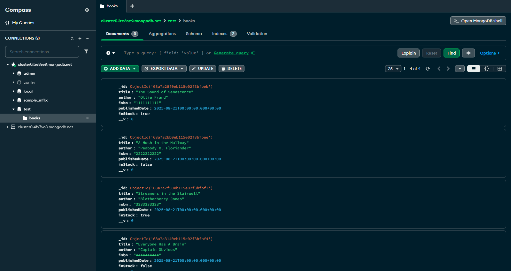

# Lab 13.2: Mongoose Models and Schemas

[Karl Johnson](https://github.com/hirekarl)  
2025-RTT-30  
<time datetime="2025-08-21">2025-08-21</time>  



## Overview
### Viewer Instructions
1. In the terminal, run:

```bash
cd digital-bookshelf-api && npm i && npm run dev
```

2. Test given API endpoints at http://localhost:3001/api/books/ in, e.g., Postman.

### Submission Source
Main application behavior can be found in [`./digital-bookshelf-api/server.js`](./digital-bookshelf-api/server.js).

### Reflection
1. Why is it beneficial to separate your routes, models, and database connection into different directories?
> Separating routes, models, and database connection helps to facilitate separation of concerns, which allows for a cleaner, more organized, and more scalable codebase. More elements can be added more easily, existing elements can be debugged more effectively, and it's easier for human programmers to determine the context and behavior of each element.

2. What is the difference between `PUT` and `PATCH` HTTP methods, and which one does your `PUT /:id` endpoint more closely resemble?
> `PUT` replaces a whole record, while `PATCH` updates only elements of a record. My implementation, with `findByIdAndUpdate`, more closely resembles a `PATCH`, since the only fields required are the fields which need to be updated. If all fields are included in the object that goes in the second argument to `findByIdAndUpdate`, the route behaves functionally the same as a `PUT` request handler.

3. In the `DELETE` route, what is a good practice for the response you send back to the client after a successful deletion? Should you send the deleted object, a simple success message, or something else? Why?
> [According to MDN](https://developer.mozilla.org/en-US/docs/Web/HTTP/Reference/Methods/DELETE), an HTTP `204 No Content` is an acceptable response to a successful deletion; a `200 OK` response with a message indicating successful deletion is also acceptable. Sending `204 No Content` saves bandwidth and allows for faster response on the server side; a `200 OK` response can include a more specific response, but requires more overhead.

## Assignment
A local library wants to modernize its book tracking system. They have hired you to build the backend for a new “Digital Bookshelf” application. Your first task is to create a RESTful API that allows librarians to manage their book inventory. This API must support creating new book records, viewing the list of all books, finding a specific book by its ID, updating a book’s information, and removing a book from the collection.
